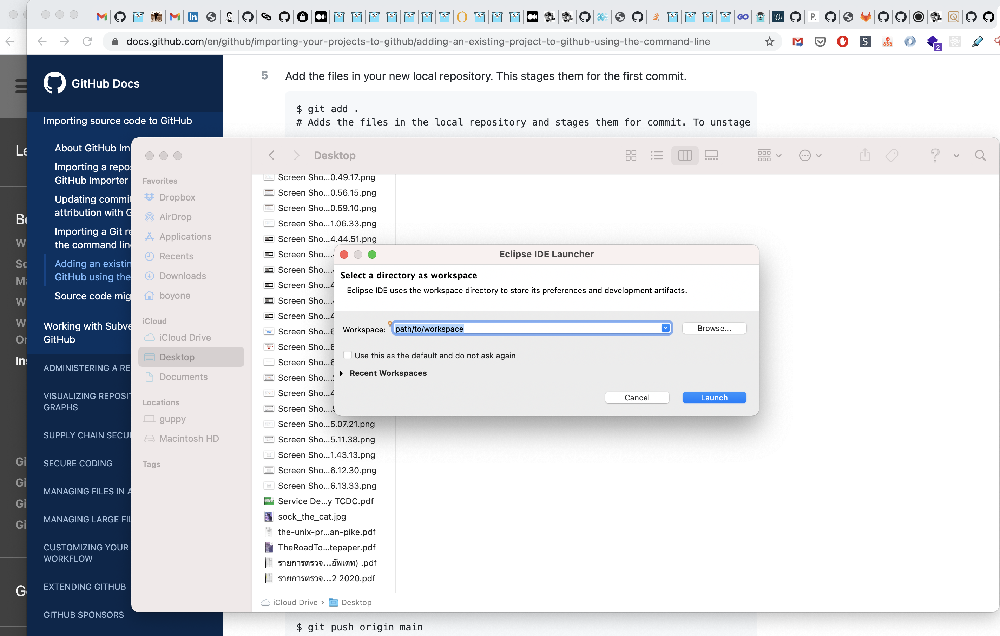
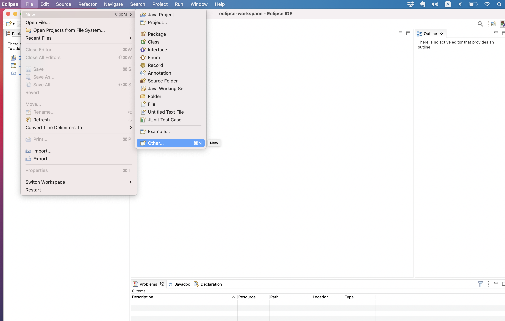
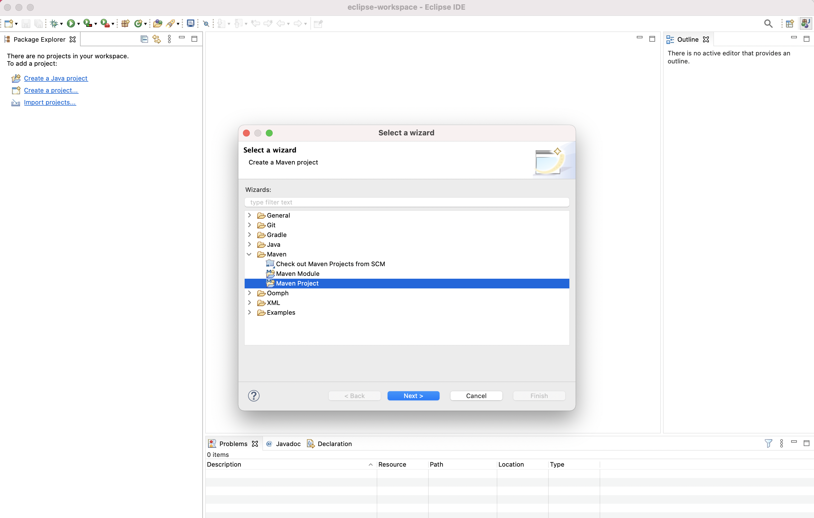
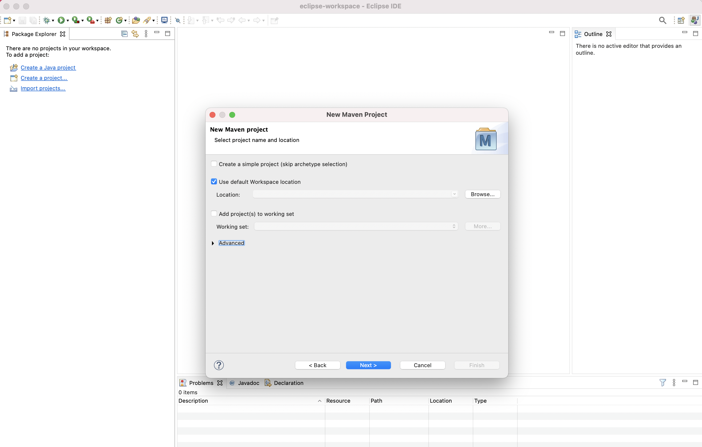
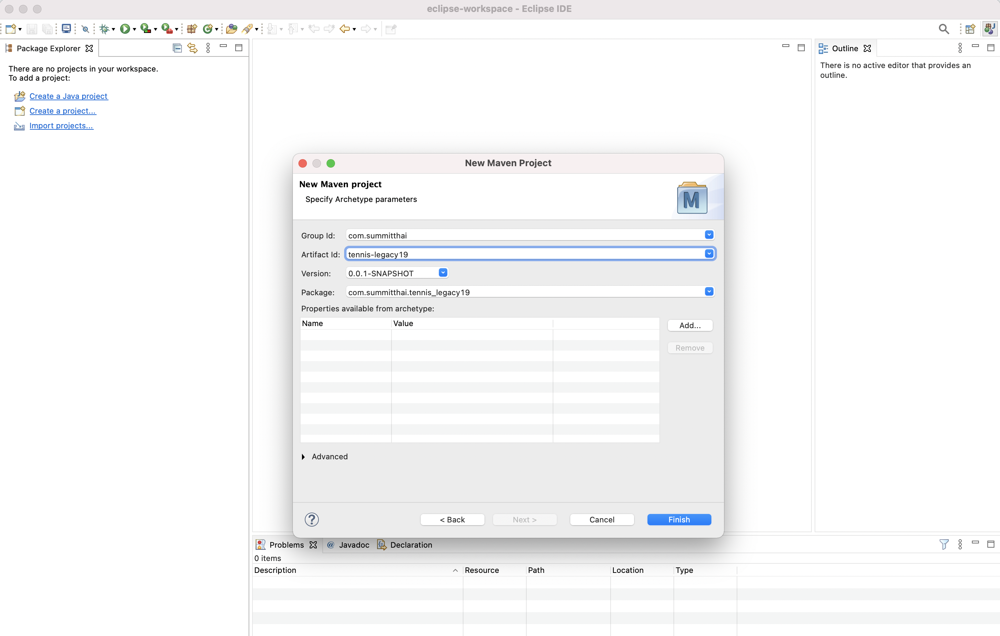

# Tennis

You task is to implement a tennis scoring program.
Summary of tennis scoring:

1. A game is won by the first player to have won at least four points in total and at least two points more than the opponent.

2. The running score of each game is described in a manner peculiar to tennis: scores from zero to three points are described as "love", "fifteen", "thirty", and "forty" respectively.

3. If at least three points have been scored by each player, and the scores are equal, the score is "deuce".

4. If at least three points have been scored by each side and a player has one more point than his opponent, the score of the game is "advantage" for the player in the lead.

[source http://en.wikipedia.org/wiki/Tennis#Scoring]

---

## Rule

| ชื่อ    | username     | repository      | https                                               |
| ------- | ------------ | --------------- | --------------------------------------------------- |
| นัท     | nuttipol     | tennis-legacy01 | https://github.com/nuttipol/tennis-legacy01.git     |
| ต๋า     | charleech    | tennis-legacy02 | https://github.com/charleech/tennis-legacy02.git    |
| ต้น     | tonalpha     | tennis-legacy03 | https://github.com/tonalpha/tennis-legacy03.git     |
| ต้าร์   | chutima-ju   | tennis-legacy04 | https://github.com/chutima-ju/tennis-legacy04.git   |
| ตัวเล็ก | terexwizard  | tennis-legacy05 | https://github.com/terexwizard/tennis-legacy05.git  |
| อาร์ท   | artcung      | tennis-legacy06 | https://github.com/artcung/tennis-legacy06.git      |
| เอ      | Freedom0036  | tennis-legacy07 | https://github.com/Freedom0036/tennis-legacy07.git  |
| วิตร    | sawit857     | tennis-legacy08 | https://github.com/sawit857/tennis-legacy08.git     |
| ตั้ม    | newBaros     | tennis-legacy09 | https://github.com/newBaros/tennis-legacy09.git     |
| อาร์ม   | zicula06     | tennis-legacy10 | https://github.com/zicula06/tennis-legacy10.git     |
| บูม     | iloveboom    | tennis-legacy11 | https://github.com/iloveboom/tennis-legacy11.git    |
| ไผ่     | tiwakorn     | tennis-legacy12 | https://github.com/tiwakorn/tennis-legacy12.git     |
| ฟลุ๊ค   | lovefook2540 | tennis-legacy13 | https://github.com/lovefook2540/tennis-legacy13.git |
| โอม     | niti-sdpt    | tennis-legacy14 | https://github.com/niti-sdpt/tennis-legacy14.git    |
| เอ      | titipong88   | tennis-legacy15 | https://github.com/titipong88/tennis-legacy15.git   |

1. [Create a Repo](https://docs.github.com/en/github/getting-started-with-github/create-a-repo) call tennis-legacy[xx]

2. Create project on local machine

   create directory call **_workspace_**

   >   
   >   
   >   
   >   
   >   
   > 

3. Go To project

   ```sh
   cd path/to/tennis-legacy19
   ```

4. Initialize the local directory as a Git repository.

   ```sh
   git init -b main
   ```

5. Add the files in your new local repository.

   ```sh
   git add .
   ```

6. Commit the files that you've staged in your local repository.

   ```sh
   git commit -m "Init project"
   ```

7. Add remote repository.

   ```sh
   git remote add origin git@github.com:<username>/tennis-legacy[xx].git
   ```

8. Verifies the new remote URL

   ```sh
   git remote -v
   ```

9. Push the changes in your local repository to GitHub.

   ```sh
   git push origin main
   ```

   or

   > use this command for the first time

   ```sh
   git push -u origin main
   ```

   > then the next time when you push can use only

   ```sh
   git push
   ```

10. Implement 30 minutes.

11. Turn around

    นัท clone ต๋า's repository  
    ต้น clone ต้น's repository  
    ...  
    โอม clone เอ's repository  
    เอ clone นัท's repository

    e.g. โอม clone เอ's repository

    ```sh
    cd path/to/workspace
    git clone git@github.com:titipong88/tennis-legacy15.git
    ```

12. Open project with your IDE, then continuous implement(30 minutes).

13. Stage your changes

    ```sh
    git add <changed files>
    ```

14. Commit the files that you've staged in your local repository.

    ```sh
    git commit -m "Your commit message"
    ```
